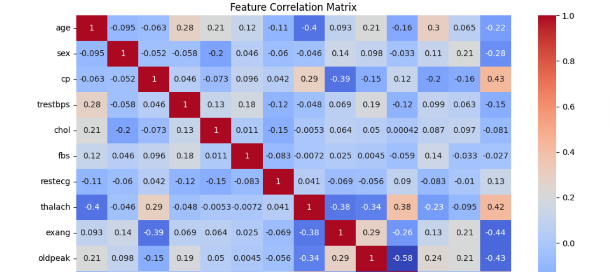
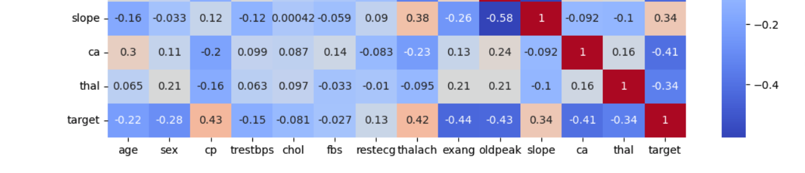
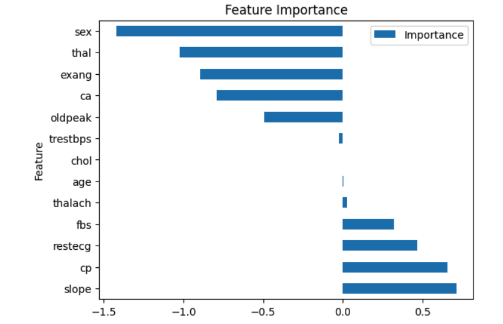
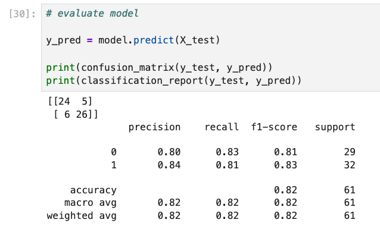

# 🫀 Heart Disease Prediction Using Machine Learning

## 📌 Project Overview
This project uses machine learning to predict the presence of heart disease based on patient medical data.  
The goal is to identify key risk factors and build a predictive model that can assist in early diagnosis support.

---

## 📊 Dataset Description
The dataset contains medical attributes of patients, including:

- Age
- Sex
- Chest pain type (cp)
- Resting blood pressure (trestbps)
- Cholesterol level (chol)
- Fasting blood sugar (fbs)
- Maximum heart rate achieved (thalach)
- Exercise-induced angina (exang)
- ST depression (oldpeak)
- Number of major vessels (ca)
- Thalassemia type (thal)

Target:
- `target = 1` → Heart disease present  
- `target = 0` → No heart disease  

---

## ⚙️ Tools & Technologies
- Python
- Pandas, NumPy
- Matplotlib, Seaborn
- Scikit-learn
- Logistic Regression

---

## 🧪 Project Workflow

### 1. Data Understanding
- Explored dataset structure (303 rows, 14 columns)
- Checked missing values (none found)
- Identified categorical vs numerical features

### 2. Exploratory Data Analysis (EDA)
- Distribution of target variable
- Correlation analysis between features
- Relationship between chest pain type, heart rate, and disease outcome

### 3. Data Preprocessing
- Handled categorical variables using One-Hot Encoding
- Ensured model does not assume ordinal relationships in categorical data

### 4. Model Building
- Logistic Regression model trained on 80% of data
- Tested on remaining 20%

---

## 📈 Model Performance

### Baseline Model:
- Accuracy: ~82%

### Improved Model (with One-Hot Encoding):
- Accuracy: ~85%
- ROC-AUC Score: ~0.94

---

## 📉 Key Insights

- Chest pain type (`cp`) is strongly associated with heart disease risk
- Maximum heart rate (`thalach`) is an important predictor
- Exercise-induced angina (`exang`) shows strong negative correlation with heart disease
- Proper encoding of categorical variables improved model performance

---

## 💡 Key Learnings

- Feature engineering significantly impacts model performance
- Categorical variables must be carefully handled to avoid misleading relationships
- Simple models like Logistic Regression can perform well with good preprocessing

---

## 🚀 Future Improvements

- Try advanced models (Random Forest, XGBoost)
- Perform hyperparameter tuning
- Build a web app using Streamlit for live predictions
- Deploy model using cloud services

---

## 👨‍💻 Author
Samuel Akiwumi Ade  
Data Scientist | ALX Africa Graduate 
Passionate about using data to solve real-world problems

---

## 📌 Note
This project is part of my data science portfolio to demonstrate skills in:
- Data analysis
- Machine learning
- Feature engineering
- Model evaluation

## 📊 Visualizations

### Correlation Matrix

### Feature importance

### Confusion Matrix

## 📈 Final Results

- Logistic Regression Accuracy: 85%
- ROC-AUC Score: 0.94
- Balanced performance across both classes

This shows the model can reliably distinguish between patients with and without heart disease.